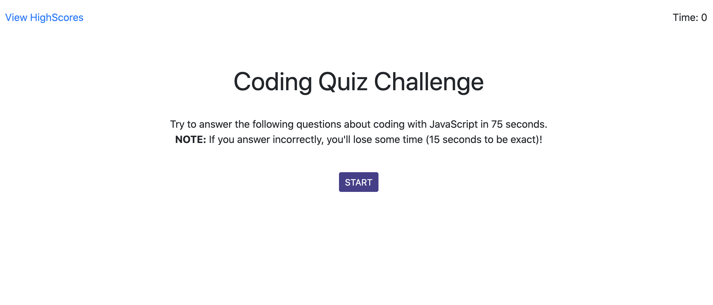
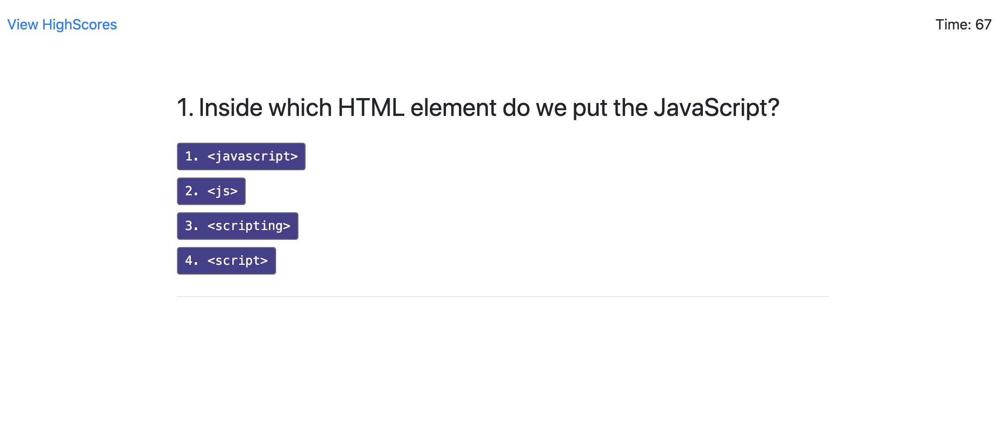
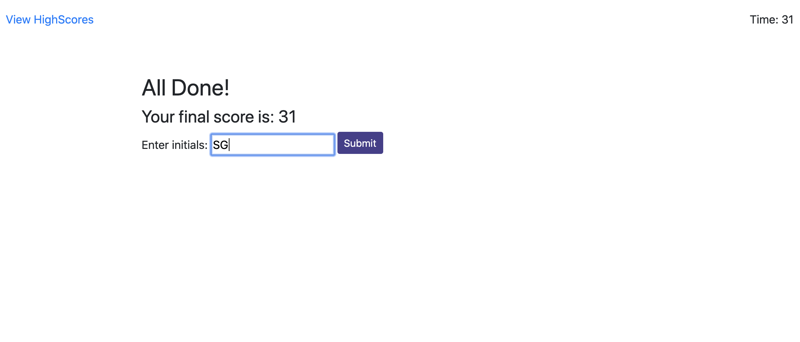

# Code Quiz Challenge
## Summary
This Application create a quiz with multiple choice questions using HTML,CSS and JavaScript. This project emphasizes the use of using Javascript to make dynamic changes to an HMTL document

## Features
- A Start Quiz button
  - This starts a timer for the user, each question averages 15 seconds each for a total time of 75 seconds.
- An appended HTML page that features questions, and multiple choice answers
  - If questions are answered incorrectly, 15 seconds are deducted off remaining time.
  - An event listener, "click" event is done and track the answers.
  - Answer feedback is given.
- Score page
  - Final score which is calculated using time remaining.
  - Input area to record initials.
  - A Submit button.
  - Submit buttom saves initials and score to local storage.
- Highscore page
  - This a list summary of intials and final scores.
  - Clear button resets the page and local storage.
  - Go back button travels to the start of the quiz.

You can run this Application and take a Code quiz [here] (https://karpagasathya.github.io/hw4_code_quiz/)

## Screenshots

